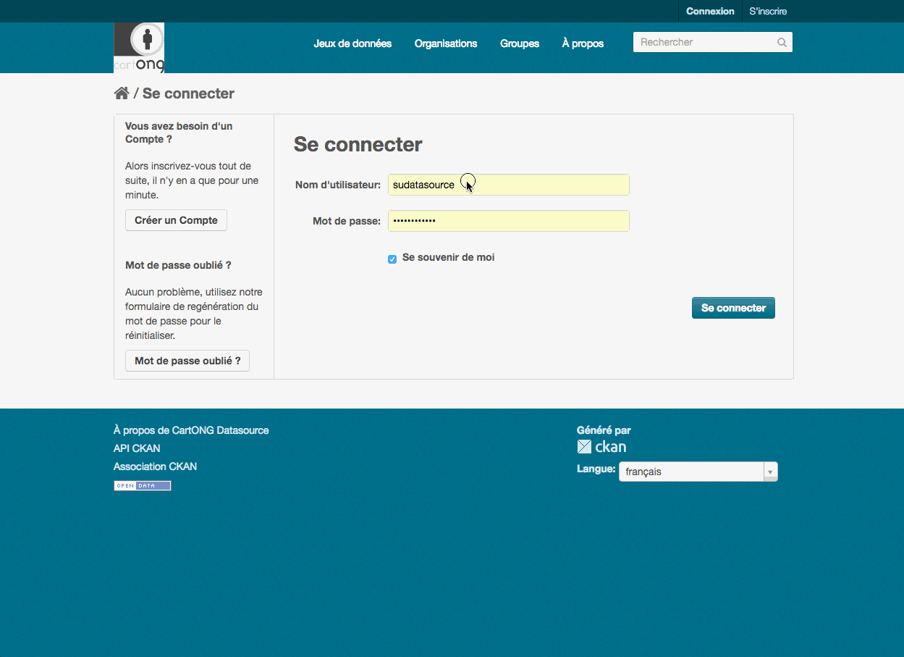

## Nouveaux utilisateurs CARTONG

pour que les nouveaux utilisateurs puissent éditer au nom de l'organisation CARTONG dans datasource, il faut les associer à l'organisation.

L'option étant un peu caché, voici un gif :
